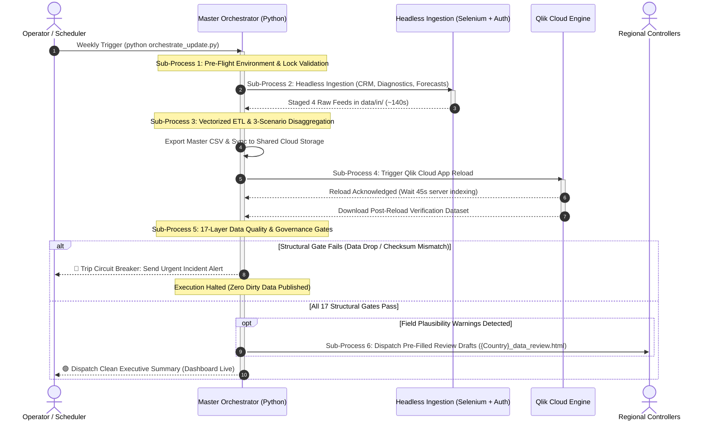

# Enterprise Commercial BI & ETL Pipeline Suite
[](https://python.org)
[](tests/)
[](docs/pipeline_orchestration.bpmn)
[](#-multi-layer-quality--governance-gates)
[](#)

> **Enterprise-grade automated data pipeline** reconciling multi-source commercial CRM actuals, diagnostic registries, and corporate planning forecasts across **8 European markets and 13 export territories**.
> Features automated headless browser ingestion, 3-scenario dynamic financial disaggregation, a 17-layer data quality circuit breaker, and closed-loop cloud BI synchronization.

---

## 📌 30-Second Executive Summary

| Business Challenge (Before) | Technical Solution (Automated) | Quantified Business Impact |
| :--- | :--- | :--- |
| **Manual Wrangling:** Downloading extracts across 4 separate systems; 6–8 hours spent weekly standardizing inconsistent European number formats in Excel. | **Headless Selenium + Vectorized Pandas:** Automated ingestion with persistent saved browser authentication; custom regex smart parser standardizing heterogeneous number formats. | **~98% reduction in runtime** (from ~8 hours down to **under 4 minutes**), saving **40+ hours annually** with zero single-person operational dependency. |
| **Silent Data Corruption:** Risk of formula errors, dropped distributor territories, or misparsed currency formats reaching executive dashboards. | **17-Tier Data Quality Circuit Breaker:** Active reconciliation gates ($Units_{in} = Units_{out}$), 10x magnitude spike catchers, and human-error heuristics. | **Zero dirty data published:** Execution automatically halts on discrepancy; local controller review email drafts generated dynamically. |
| **Operational Knowledge Silo:** Process dependent on one person's tribal knowledge of data quirks and manual mapping tables. | **Turnkey Governance & Code-Free Config:** Product and country mappings externalized to YAML; comprehensive 1-hour operator onboarding manual. | **Junior analysts or interns onboard in under 1 hour**; non-technical staff maintain product catalogs without code changes. |

---

## 🗺️ System Architecture & BPMN 2.0 Process Map

The pipeline executes a 4-lane orchestration sequence across the Operator, Master Orchestrator, Ingestion layer, and Cloud BI platform. The underlying process model is authored in standard **OMG BPMN 2.0** with hierarchical sub-processes:


*The complete interactive BPMN 2.0 XML model is available at [`docs/pipeline_orchestration.bpmn`](docs/pipeline_orchestration.bpmn). It can be opened directly in [Camunda Modeler](https://camunda.com/download/modeler/) (double-click sub-processes to drill down) or viewed online in [bpmn.io](https://demo.bpmn.io).*



---

## 📚 Portfolio Documentation Suite

This repository includes a comprehensive 5-piece documentation package designed to demonstrate end-to-end data engineering, architecture, and stakeholder communication capabilities:

| Document | Focus Area | What It Demonstrates |
| :--- | :--- | :--- |
| 🏆 **[Executive Case Study](docs/PORTFOLIO_EXECUTIVE_CASE_STUDY.md)** | Business Strategy & ROI | Project brief in the STAR format, financial impact, operational ROI metrics, and architectural overview. |
| 🛡️ **[Data Quality & Governance Matrix](docs/PORTFOLIO_DATA_QUALITY_MATRIX.md)** | Reliability Engineering | Detailed 5-tier defense-in-depth classification of all 17 quality checks, real-world failure prevention case studies (1,000x inflation bug). |
| 📚 **[Turnkey Operations & Training Guide](docs/PORTFOLIO_HANDOVER_TRAINING_GUIDE.md)** | Enablement & Handover (Schulung) | Operator onboarding SOP, pre-flight checklists, code-free business maintenance playbooks, and 12-scenario incident response table. |
| 🌟 **[Technical Capability Showcase](docs/PORTFOLIO_TECHNICAL_CAPABILITY_SHOWCASE.md)** | Advanced Engineering | Deep dives into multi-scenario disaggregation, headless browser-session persistence, regex number coercion, and cloud BI verification. |
| 🗺️ **[BPMN 2.0 Process Model](docs/PORTFOLIO_BPMN_PROCESS_FLOW.md)** | Process Visualization | Full BPMN 2.0 hierarchical sub-process specifications and instructions for interactive inspection in Camunda Modeler. |

---

## 🔬 Core Technical Innovations

### 1. Dynamic Multi-Scenario Commercial Disaggregation
Commercial leadership evaluates performance through three distinct analytical perspectives:
* **Full Market:** Total procedure volume across all market competitors.
* **Addressable Market:** Market filtered exclusively to categories where the organization competes.
* **Addressable Weighted Market:** Opportunity-adjusted market using proprietary therapy weighting factors.

The engine dynamically synthesizes all three reporting scenarios while enforcing an automated **Mathematical Conservation Guard** ($Units_{BIO}$ remains invariant across all scenarios).

### 2. European Heterogeneous Numeric Parser (`_smart_parse()`)
Ingests extracts from subsidiaries across Germany, France, the UK, and Switzerland containing conflicting numerical formats:
* German extracts: `6.170,00` (comma decimal, period thousand)
* US/UK extracts: `6,170.00` (period decimal, comma thousand)
* Swiss/Nordic extracts: `6'170.00` (apostrophe thousand separator)

The custom regex engine evaluates string character positions dynamically, preventing volume calculation corruptions.

### 3. Closed-Loop Cloud BI Handshake
Rather than pushing data blindly, the pipeline executes a bidirectional verification handshake:
1. Dispatches authenticated reload command to Qlik Cloud API/DOM.
2. Waits 45 seconds for cloud data model stabilization.
3. Downloads the live post-reload audit sheet (`MarketData_Add_Final_Qlik_Verified.csv`).
4. Compares cloud aggregate Net Revenue and Unit volumes against the Python master CSV ($Tolerance < 1.00\text{ EUR}$).

### 4. Automated Regional Governance Drafts
When soft plausibility anomalies are detected (copy-paste forecast inertia, suspiciously round figures like `500`, or unchanged baselines), the engine automatically compiles **responsive, pre-filled HTML review drafts** (`controller_drafts/{Country}_data_review.html`) customized for regional financial controllers.

---

## 🧪 Chaos Engineering & Automated Test Harness

The pipeline is backed by a **106-test automated test suite** that validates system stability against intentionally corrupted synthetic spreadsheets:

```bash
# Run the complete test suite
python -m pytest tests/test_stress_pipeline.py -v --tb=short
```

```text
============================= test session starts ==============================
collected 106 items

tests/test_stress_pipeline.py::TestNumericParsing (17 tests) ................. PASSED
tests/test_stress_pipeline.py::TestQuarterParsing (9 tests) ......... PASSED
tests/test_stress_pipeline.py::TestProductMapping (3 tests) ... PASSED
tests/test_stress_pipeline.py::TestCountryMapping (5 tests) ..... PASSED
tests/test_stress_pipeline.py::TestSchemaValidation (2 tests) .. PASSED
tests/test_stress_pipeline.py::TestCRMLoader (5 tests) ..... PASSED
tests/test_stress_pipeline.py::TestICMMarketLoader (3 tests) ... PASSED
tests/test_stress_pipeline.py::TestICMBIOLoader (2 tests) .. PASSED
tests/test_stress_pipeline.py::TestForecastLoader (6 tests) ...... PASSED
tests/test_stress_pipeline.py::TestProductLogic (8 tests) ........ PASSED
tests/test_stress_pipeline.py::TestColumnSafety (2 tests) .. PASSED
tests/test_stress_pipeline.py::TestOutputValidation (9 tests) ......... PASSED
tests/test_pipeline_logic.py (35 tests) ................................... PASSED

======================== 106 passed in 8.42s =========================
```

---

## 🚀 Quick Start (Local Execution)

### Prerequisites
* Python 3.10+
* Google Chrome (for headless browser automation)

### Installation
```bash
# Clone the repository
git clone https://github.com/YOUR_USERNAME/enterprise-bi-etl-pipeline.git
cd enterprise-bi-etl-pipeline

# Install dependencies
pip install -r requirements.txt
```

### Running the Pipeline
```bash
# Standard Execution (Ingestion, transformation, cloud reload, and quality gates)
python orchestrate_update.py

# Reprocess existing data without re-downloading (useful after config edits)
python orchestrate_update.py --skip-downloads

# Safe dry-run mode (simulates pipeline without cloud reload or sending emails)
python orchestrate_update.py --dry-run
```

---

## 🗺️ Interactive BPMN 2.0 Inspection

The raw XML process model is located at [`docs/pipeline_orchestration.bpmn`](docs/pipeline_orchestration.bpmn).

To inspect the model interactively:
1. **Desktop:** Open the file in [Camunda Modeler](https://camunda.com/download/modeler/) (v5.x+) and double-click any collapsed sub-process box to drill into its internal operations.
2. **Web Browser:** Drag and drop `pipeline_orchestration.bpmn` into the [bpmn.io Web Viewer](https://demo.bpmn.io).

---

## 🔒 Confidentiality & Data Governance Notice
*This repository represents an anonymized architectural showcase. Organization identity, internal corporate portal URLs, proprietary clinical product identifiers, and commercial revenue figures have been sanitized or normalized to protect intellectual property while preserving authentic technical architecture, mathematical logic, and unit conservation principles.*

---

## 📄 License
This project is licensed under the MIT License — see the [LICENSE](LICENSE) file for details.
