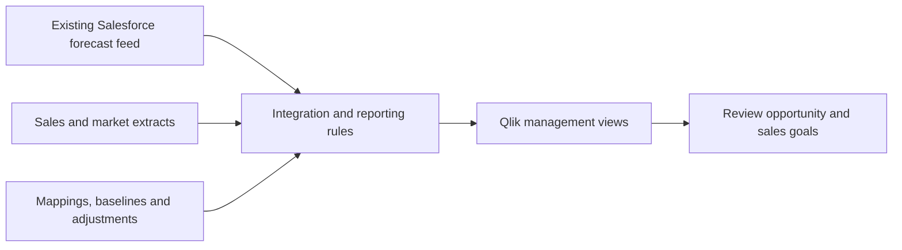

# Forecast-to-Qlik: From Manual Preparation to Management Review

**Give regional planning decisions the market context that a raw forecast feed could not provide.**

An existing Salesforce-to-Qlik feed lacked the additional market sources, checks, adjustments and reporting views management needed. Each update required a separate Excel calculation and upload cycle.

**My contribution:** I coordinated country, finance and IT requirements and built the integration, business calculations and validation around that existing feed. I made market definitions, forecast baselines and exception handling explicit so the outputs could support opportunity and sales-goal discussions.

**Result and status:** consistent forecast and market views across nine countries without the separate Excel calculation and upload. The public example demonstrates selected transformations and controls with fictional inputs; live connections are excluded. The historical workload and refresh limits are explained below.

[Read the business case](https://matthew-bangle-data-portfolio.mattbangle.chatgpt.site/work/forecast-to-qlik) · [Run the public example](#run-and-inspect-the-implementation)



*Conceptual historical workflow. The code below demonstrates selected transformations and controls with fictional data.*

## What changed for the business

Management could review forecast updates with the market context needed to discuss opportunity and sales goals, without repeating the separate Excel calculation and upload. I had performed that preparation myself: a simple calculation and upload took about **three hours**, with **up to another five hours** of validation when many changes occurred. These are estimates of the former workload, not a fixed saving on every refresh.

The integration supported reporting across **nine countries**. Refresh timing depended on the connected systems; the outcome was a repeatable route from updated inputs to management review.

## Decisions that made the reporting useful

Salesforce data already flowed into Qlik. The missing piece was the additional market context and consistent definitions needed to interpret it. Direct warehouse and source-data access was unavailable to me, so I worked with available reporting extracts.

| Business question or constraint | Design decision | What it enables |
| --- | --- | --- |
| Which part of the market can we serve? | Keep full, addressable and weighted market views explicit | More realistic opportunity and sales-goal discussions |
| Have expectations changed since planning? | Keep live forecasts and saved baselines identifiable | Compare revised expectations with an earlier position |
| Sources use different products and territories | Maintain explicit mappings and adjustment inputs | Review performance under consistent reporting responsibility |
| Annual market estimates meet quarterly actuals | Allocate estimates while retaining observed quarterly company figures | Compare periods without presenting modeled quarters as observed sales |
| Some categories are missing from a reference source | Add separate diagnostic and supplementary market inputs | Cover reporting needs that one market source cannot satisfy |
| Numbers and totals can change during integration | Parse declared conventions and reconcile scope and totals | Detect problems before treating a result as reliable |

References to SAP sales and Salesforce forecasts describe the business origin of the data, not new direct connectors I built. The [Qlik Reporting Access Bridge](https://github.com/mattbang/qlik-cloud-data-bridge) explains the acquisition work supporting this pipeline; its benefits are not counted separately.

## Inspect a result in two minutes

The fictional demo retains **997 organization units** and **€5.692 million in organization revenue** across three scenarios. The market denominator changes; the organization's figures remain constant.

| Scenario | Market units | Organization units |
| --- | ---: | ---: |
| Full market | 3,790.0 | 997 |
| Addressable market | 3,670.0 | 997 |
| Addressable, weighted | 2,959.6 | 997 |

See the [dataset](docs/demo_output/transformed_dataset.csv), [quality report](docs/demo_output/data_quality_report.json) and [output walkthrough](docs/DEMO_OUTPUT_WALKTHROUGH.md). These are synthetic demonstration results, not employer figures.

## Run and inspect the implementation

Python · pandas · NumPy · YAML · Qlik reporting integration

[](LICENSE)
[](https://github.com/mattbang/enterprise-commercial-etl-pipeline/actions/workflows/ci.yml)

Python 3.10 or 3.12, as configured in the public test workflow:

```sh
python -m venv .venv
source .venv/bin/activate  # Windows PowerShell: .venv\Scripts\Activate.ps1
python -m pip install -r requirements-demo.txt
python demo.py
```

The run writes a dataset, scenario summary, quality report and summary to `demo_output/`. It needs no company account.

To inspect an intentional failure:

```sh
python demo.py --simulate-capacity-failure --output-dir demo_output/failure_example
```

Nine demo checks pass and one fails. The run exits unsuccessfully and publishes no CSV outputs. This demonstrates a selected control, rather than universal data correctness.

## Technical evidence and operating boundaries

- **Transformation:** Python, pandas, NumPy and YAML for mappings, scenarios and calculations.
- **Quality:** contracts, numeric parsing, conservation and reconciliation checks.
- **Operations:** documented configuration, process maps and handover guidance.
- **Public tests:** `python -m pip install -r requirements-test.txt`, then `python -m pytest -q`.

The public production-reference orchestrator requires unpublished connectors and configuration. Use `demo.py` for the supported public workflow. Current pre-reload controls can preserve the last valid local dataset; downstream verification occurs after reload and cannot guarantee that a later discrepancy was never visible. Missing verification produces an unverified result, not a successful one.

| Read further | What it helps you assess |
| --- | --- |
| [My contribution and handover](docs/PORTFOLIO_EXECUTIVE_CASE_STUDY.md) | Business context, responsibilities and operational delivery |
| [Public demo boundary](docs/PUBLIC_DEMO_BOUNDARY.md) | What runs locally and which integrations are excluded |
| [Quality matrix](docs/PORTFOLIO_DATA_QUALITY_MATRIX.md) | Blocking checks, downstream verification and review heuristics |
| [Technical showcase](docs/PORTFOLIO_TECHNICAL_CAPABILITY_SHOWCASE.md) | Implementation and coverage |
| [Process model](docs/PORTFOLIO_BPMN_PROCESS_FLOW.md) | Orchestration and handoffs |
| [Handover guide](docs/PORTFOLIO_HANDOVER_TRAINING_GUIDE.md) | Maintenance and investigation |

AI coding assistants supported implementation and documentation. Business definitions, design decisions and review remain my responsibility. Employer data and private connectors are excluded. MIT licensed; see [LICENSE](LICENSE).

[Matthew Bangle on LinkedIn](https://www.linkedin.com/in/matthew-bangle/) · [Full portfolio](https://matthew-bangle-data-portfolio.mattbangle.chatgpt.site/work)
