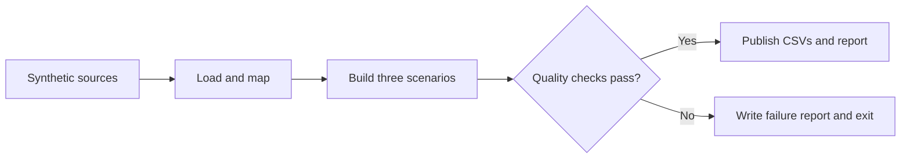

# Enterprise Commercial ETL Pipeline

[](https://github.com/mattbang/enterprise-commercial-etl-pipeline/actions/workflows/ci.yml)

**Three reporting views, consistent organization totals, and quality checks that block invalid output.** This Python project turns SAP sales downloads, MedTech Europe market data, Salesforce forecast updates, and internally managed sales and market-share forecasts into Full, Addressable, and Weighted market scenarios for regional finance teams across 9 countries. The production workflow reduced turnaround time between forecast updates and refreshed management visuals used for goal setting and performance benchmarking. A runnable synthetic demo makes the transformations and controls easy to inspect.

Built by [Matthew Bangle](https://www.linkedin.com/in/matthew-bangle/), working across business analysis, data quality, reporting automation, and operational handover.

The public demo uses synthetic inputs and needs no company account or private service. The production case study describes a wider Python-to-Qlik Sense workflow whose private SAP, Salesforce, forecasting, and BI connectors are excluded. See the [scope and limitations](docs/PUBLIC_DEMO_BOUNDARY.md).

## The Result

The sample run preserves **997 organization units** and **5,692 K EUR in synthetic organization revenue** across all three scenarios. Only the market perspective changes.

| Scenario | Rows | Market units | Market revenue (K EUR) | Organization units |
| :--- | ---: | ---: | ---: | ---: |
| Actual Full | 10 | 3,790.0 | 21,440.0 | 997 |
| Actual Addressable | 9 | 3,670.0 | 21,200.0 | 997 |
| Actual Addressable weighted | 9 | 2,959.6 | 17,080.6 | 997 |

Inspect the [output walkthrough](docs/DEMO_OUTPUT_WALKTHROUGH.md), [transformed dataset](docs/demo_output/transformed_dataset.csv), and [10-check demo quality report](docs/demo_output/data_quality_report.json). The [one-page project handout](https://www.canva.com/design/DAHUhMvhimY/view) summarizes the project for a conversation or interview.

## Run the Demo

Use Python 3.10 or 3.12, the versions covered by CI.

```bash
git clone https://github.com/mattbang/enterprise-commercial-etl-pipeline.git
cd enterprise-commercial-etl-pipeline
python -m venv .venv
# macOS / Linux:
source .venv/bin/activate
# Windows PowerShell: .venv\Scripts\Activate.ps1
python -m pip install -r requirements-demo.txt
python demo.py
```

The run writes a dataset, scenario summary, quality report, and run summary to `demo_output/`.

## See a Controlled Failure

```bash
python demo.py --simulate-capacity-failure --output-dir demo_output/failure_example
```

This injects a capacity violation. Nine checks pass and one fails; the process exits unsuccessfully, records the failure, and publishes no CSV outputs. Read the committed [failure report](docs/demo_output/failure_example/data_quality_report.json) and [run summary](docs/demo_output/failure_example/run_summary.txt).

## What I Built

The project connects business definitions to testable reporting logic:

- Defined reporting grain, product mappings, territory rules, and three market scenarios.
- Integrated SAP sales actuals, MedTech Europe market references, Salesforce-entered forecast updates, internally led forecast inputs, and Qlik Sense reporting outputs into one governed flow.
- Implemented Python loading, numeric normalization, transformation, and reconciliation.
- Added checks for schema, mappings, capacity, conservation, and publication readiness.
- Designed orchestration with explicit success, failure, and unverified outcomes.
- Documented the process in BPMN and prepared maintenance and handover guidance.
- Packaged synthetic fixtures, repeatable tests, and GitHub Actions for public review.

AI coding assistants supported implementation, test-fixture generation, and documentation. Business definitions, design decisions, and review remain the author's responsibility; the public tests provide inspectable evidence of behavior.

## How It Works



Business rules live in configuration. The transformations change market scope and weighting while keeping organization totals constant. Numeric parsing supports European, US, and Swiss formats; ambiguous values require an explicit interpretation rather than a silent guess.

The production-reference sequence extends this with validated CSV publication, Qlik reload, and reconciliation against fresh downstream evidence. Blocking local failures preserve the last valid dataset. Missing or stale downstream evidence yields `UNVERIFIED` (exit 2); failures exit 1 and verified success exits 0. Downstream verification happens after publication and does not guarantee that a later BI discrepancy was never visible.

`orchestrate_update.py` requires unpublished connectors and environment configuration. Use `demo.py` for the supported public workflow. The [editable BPMN model](docs/pipeline_orchestration.bpmn) and [process guide](docs/PORTFOLIO_BPMN_PROCESS_FLOW.md) provide the detailed production architecture.

## Technology

| Area | Tools and purpose |
| :--- | :--- |
| Public demo | Python, pandas, NumPy, YAML: load, transform, and apply rules |
| Validation and tests | Pandera, pytest, openpyxl: contracts, regressions, and workbook fixtures |
| Continuous integration | GitHub Actions on Python 3.10 and 3.12 |
| Production case study | SAP sales downloads, Salesforce forecast updates, MedTech Europe market data, internal sales and market-share forecasts, Qlik Sense reporting, BPMN 2.0 process documentation |

## Verification

```bash
python -m pip install -r requirements-test.txt
python -m pytest -q
```

The public suite covers parser edge cases, mapping rules, schema rejection, conservation, scenario generation, blocking publication, terminal statuses, and the synthetic demo. Checks that need private connectors or locally generated production outputs skip explicitly when those artifacts are absent. A passing public run does not verify a live production tenant.

CI runs on pull requests and pushes to `main`. Dependency files specify supported minimum versions, not a locked environment; the workflow checks dependency consistency and tests the resolved versions.

## Business Context

The original workflow served regional finance stakeholders across 9 countries by combining SAP sales actuals, MedTech Europe market data, Salesforce-entered forecast updates, and internally maintained sales and market-share forecasts for Qlik Sense reporting. The refreshed visuals supported management goal setting and performance benchmarking. Spreadsheet preparation made reporting slow and dependent on specialist knowledge; the pipeline reduced turnaround time between forecast updates and updated management visuals.

The original implementation was delivered during previous employment and handed over on departure. This repository is maintained as a portfolio demonstration, not an active production deployment.

The case study reports a manual baseline of roughly 6-8 hours and an automated runtime under four minutes. These are historical operational estimates, not independently reproduced benchmarks of the public demo. See the [executive case study](docs/PORTFOLIO_EXECUTIVE_CASE_STUDY.md) for context.

## Further Reading

| Document | What to inspect |
| :--- | :--- |
| [Demo walkthrough](docs/DEMO_OUTPUT_WALKTHROUGH.md) | Successful output and a blocked failure |
| [Public demo boundary](docs/PUBLIC_DEMO_BOUNDARY.md) | Supported behavior and excluded integrations |
| [Quality matrix](docs/PORTFOLIO_DATA_QUALITY_MATRIX.md) | Production-reference checks and their roles |
| [Technical showcase](docs/PORTFOLIO_TECHNICAL_CAPABILITY_SHOWCASE.md) | Transformation, parsing, and verification details |
| [Handover guide](docs/PORTFOLIO_HANDOVER_TRAINING_GUIDE.md) | Mapping maintenance and incident handling |
| [Changelog](CHANGELOG.md) | Public portfolio release history |

## Contact and License

[Matthew Bangle on LinkedIn](https://www.linkedin.com/in/matthew-bangle/) · [GitHub profile](https://github.com/mattbang)

Released under the [MIT License](LICENSE). Public inputs and mapping fixtures are synthetic. Report a confidentiality concern privately using the contact route in [SECURITY.md](SECURITY.md).
