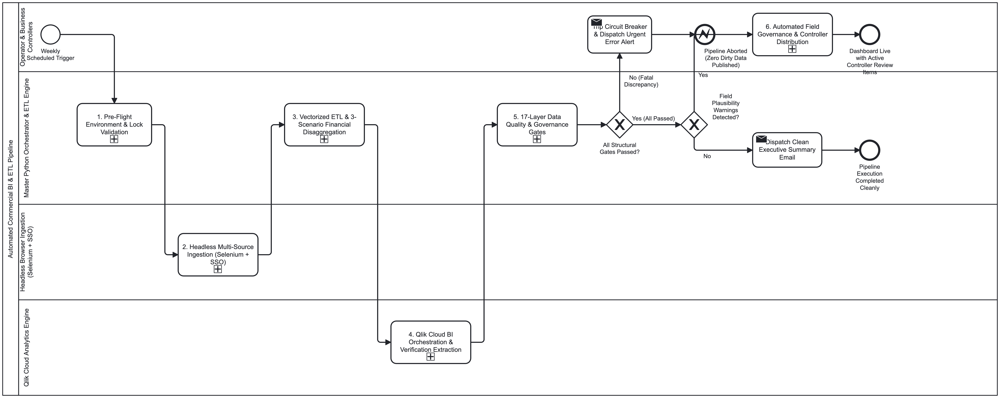
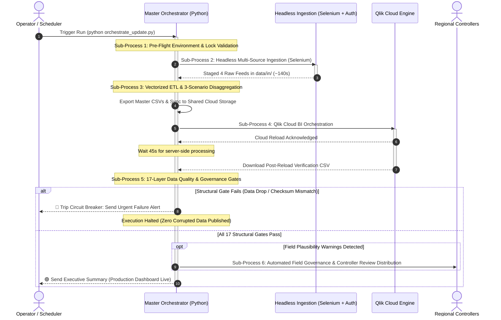

# BPMN 2.0 Hierarchical Process Flow & Sub-Process Architecture
**Document Type:** Business Process Model & Notation (BPMN 2.0) Specification
**Domain:** Commercial Healthcare & MedTech Data Engineering
**File Asset:** [docs/pipeline_orchestration.bpmn](pipeline_orchestration.bpmn)

> *Confidentiality Notice: Organization identity, internal portal URLs, proprietary product identifiers, and commercial volumes have been anonymized or normalized for portfolio presentation while strictly preserving authentic technical architecture and business logic.*

---

## 🗺️ High-Level Orchestration Flow

The top-level orchestration model links four operational lanes. Each major activity box is an **OMG BPMN 2.0 Collapsed Sub-Process** (marked with `[+]`). Double-clicking or drilling into any sub-process reveals its internal activities.

---

## 🔍 Sub-Process Drill-Down Specifications

Opening [docs/pipeline_orchestration.bpmn](pipeline_orchestration.bpmn) in **Camunda Modeler** or **bpmn.io** enables interactive drill-down into each of the 6 sub-processes. Below is the operational inventory of each sub-process:

### Sub-Process 1: Pre-Flight Environment & Lock Validation
* **Trigger:** Weekly scheduled run or manual invocation.
* **Granular Operations:**
  1. `Task_PF_EnvVars`: Expands system environment variable placeholders (`${MIDWEST_ROOT}`) and validates `config/pipeline_config.yaml` and `mappings.yaml`.
  2. `Task_PF_KillZombies`: Scans operating system processes to terminate orphan `chrome.exe` tasks and cleans temporary Microsoft Excel lock files (`~$*.xlsx`).
  3. `Task_PF_VpnCheck`: Pings configured network endpoints and verifies approved sign-in route accessibility.
* **Exit Milestone:** Environment validated; filesystem write locks cleared.

---

### Sub-Process 2: Headless Multi-Source Ingestion (Selenium + Auth)
* **Trigger:** Pre-flight checks passed.
* **Granular Operations:**
  1. `Task_DL_InitSession`: Attaches to persistent Chrome user profile (`chrome_profile_path`), bypassing interactive sign-in prompts.
  2. `Task_DL_Crm`: Navigates commercial CRM portal, triggers automated report generation, and captures historical actuals (`Market Tracker CRM DL.xlsx`).
  3. `Task_DL_Diagnostics`: Automates extraction of quarterly diagnostic registry files (`ICM_Market_DL.xlsx` & `ICM_BIO_DL.xlsx`).
  4. `Task_DL_Forecasts`: Extracts live working forecasts and point-in-time static planning baselines.
  5. `Task_DL_VerifyFiles`: Monitors the OS download folder, polling until `.crdownload` temporary buffers finish and asserting minimum file sizes ($>50\text{ KB}$).
* **Exit Milestone:** All 4 raw extracts staged in `data/in/`.

---

### Sub-Process 3: Vectorized ETL & 3-Scenario Financial Disaggregation
* **Trigger:** Raw files staged.
* **Granular Operations:**
  1. `Task_ETL_Schema`: Validates schemas and column presence using Pandera data contracts.
  2. `Task_ETL_Numeric`: Applies the custom `_smart_parse()` regex engine to normalize European comma decimals (`1.234,50`), US formats (`1,234.50`), and Swiss apostrophes (`1'234`) to standard IEEE floats.
  3. `Task_ETL_Territories`: Resolves non-standard country code aliases (`UK` &rarr; `GB`, `EL` &rarr; `GR`) and remaps 13 export territories into standard parent entities.
  4. `Task_ETL_ClinicalSplits`: Executes clinical therapy splits (single-chamber vs. dual-chamber leadless lines, transseptal access consolidations).
  5. `Task_ETL_Disaggregation`: Dynamically synthesizes the three commercial views: **Full Market**, **Addressable Market**, and **Addressable Weighted Market**.
  6. `Task_ETL_Conservation`: Enforces mathematical conservation law: ensures internal organization volume remains strictly identical across all 3 reporting views.
  7. `Task_ETL_Export`: Writes master reporting CSVs (`MarketData_Integrated_Flat.csv`) and syncs to shared cloud storage.
* **Exit Milestone:** Master reporting datasets deployed for cloud consumption.

---

### Sub-Process 4: Qlik Cloud BI Orchestration & Verification Extraction
* **Trigger:** Master CSV deployed to cloud storage.
* **Granular Operations:**
  1. `Task_BI_Trigger`: Authenticates and dispatches API/DOM reload commands to Qlik Cloud Analytics Engine.
  2. `Timer_BI_Wait`: Enforces a 45-second stabilization window allowing server-side calculation and data model indexing.
  3. `Task_BI_PollStatus`: Asserts server reload status returned `SUCCESS`; captures any memory exhaustion or indexing warnings.
  4. `Task_BI_ExportVerification`: Triggers an automated export of the live Qlik summary sheet (`MarketData_Add_Final_Qlik_Verified.csv`) to execute post-reload validation.
* **Exit Milestone:** Fresh cloud verification dataset downloaded to local workspace.

---

### Sub-Process 5: 17-Layer Data Quality & Governance Gates
* **Trigger:** Verification sheet staged locally.
* **Granular Operations:**
  1. `Task_QA_Tier1`: Verifies output file existence, timestamps, and non-zero byte size (Check 1).
  2. `Task_QA_Tier2`: Validates null-rate caps on critical dimensions and checks minimum row sanity thresholds (Checks 2, 8).
  3. `Task_QA_Tier3_Recon`: Asserts input units equal output units across all transformations and guarantees 0 lost regions (Checks 3, 4, 5, 6).
  4. `Task_QA_Tier3_Checksum`: Compares live Qlik Cloud aggregate units and Net Revenue against Python master CSV ($Tolerance < 1.00\text{ EUR}$) (Check 9).
  5. `Task_QA_Tier4`: Scans for 10x magnitude spike bugs, unapproved negative values ($< -100$), and velocity anomalies (Checks 7, 10, 14, 15, 17).
  6. `Task_QA_Tier5`: Applies human-error heuristics to detect copy-paste duplicates, round numbers (exact 100s), and unchanged forecast baselines (Checks 11, 12, 13, 16).
* **Exit Milestone:** Validation audit completed; routes to Circuit Breaker or Production Publication.

---

### Sub-Process 6: Automated Field Governance & Controller Distribution
* **Trigger:** Soft plausibility warnings detected during Tier 5 quality audit.
* **Granular Operations:**
  1. `Task_GA_ParseAnomalies`: Aggregates country-level warnings from `QA_Forecast_Plausibility.csv`.
  2. `Task_GA_RenderHtml`: Compiles personalized, responsive HTML review drafts (`controller_drafts/{Country}_data_review.html`) highlighting flagged records.
  3. `Task_GA_NotifyControllers`: Pre-populates recipient emails and submission freeze deadlines, staging ready-to-forward draft packages.
* **Exit Milestone:** Field review packages staged for regional financial controllers.

---

## 💻 How to Open and Interactively Drill Down

1. **In Camunda Modeler (Desktop):**
   * Open [docs/pipeline_orchestration.bpmn](pipeline_orchestration.bpmn).
   * Double-click any collapsed sub-process box (e.g., *2. Headless Multi-Source Ingestion*).
   * Camunda opens the dedicated sub-process canvas with its full operational flow.
   * Click any individual task to view its detailed documentation in the right-hand **Properties Panel**.
   * Click the breadcrumb at the top to navigate back to the main orchestration view.
2. **In Web Browser ([bpmn.io](https://demo.bpmn.io)):**
   * Drag-and-drop `pipeline_orchestration.bpmn` into the web editor.
   * Navigate using the diagram plane selector or double-click to drill down into sub-processes.
